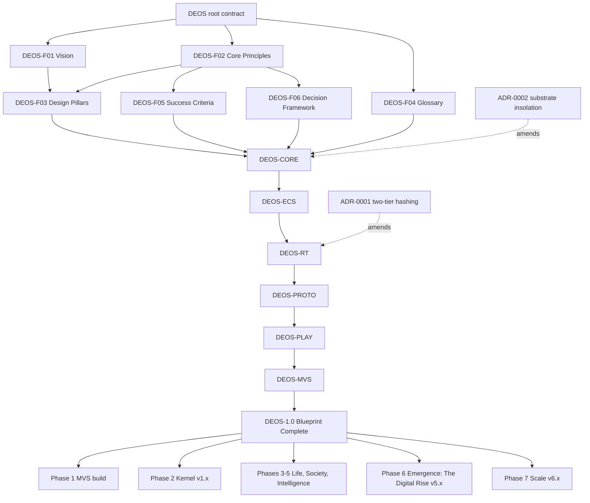

# Master System Dependency Graph

The authoritative directed acyclic graph of the DEOS specification modules and the implementation phases that follow them. A module may cite only `DEOS.md`, the Foundation, and modules above it (DEOS section 2.2); a lower module that needs something from a higher one proposes it in the `DEOS.md` shared registry through an ADR. Downstream documents cannot enter `Approved` status until every upstream document is Approved. TS-SPEC-002 checks this graph against the `Dependencies` row of every document.

```
                                     [DEOS: root contract]
                                               │
                    ┌──────────────────────────┼──────────────────────────┐
                    ▼                          ▼                          ▼
        [DEOS-F01 Vision]          [DEOS-F02 Core Principles]     [DEOS-F04 Glossary]
                    │                          │                          │
        [DEOS-F03 Design Pillars]  [DEOS-F05 Success Criteria]   [DEOS-F06 Decision Framework]
                    └──────────────────────────┼──────────────────────────┘
                                               ▼
                                    [DEOS-CORE  Mathematical Foundations & Fixed-Tick Rules]
                                               │  fx_*, tables, laws, PRNG streams, ORD
                                               ▼
                                    [DEOS-ECS   Data Schemas & Entity-Component Architecture]
                                               │  layouts, Commands, barrier resolution, serialization
                                               ▼
                                    [DEOS-RT    Simulation Loop, Threading & State Hashing]
                                               │  ABI, pipeline, Workers, Tick/Checkpoint Hash, Snapshots
                                               ▼
                                    [DEOS-PROTO Agent Cognition, Society Models & Inter-entity Rules]
                                               │  Stages 3–5, Notable Events, WorldMood, World Phases
                                               ▼
                                    [DEOS-PLAY  Player Loop, Catalyst Interface, Chronicle & Retention]
                                               │  loops, Catalyst kinds and costs, sessions, sharing
                                               ▼
                                    [DEOS-MVS   Minimum Viable Simulation]
                                               │
                                               ▼
                                    [DEOS-1.0   Blueprint Complete]
                                               │
        ┌──────────────────────┬───────────────┼───────────────┬──────────────────────┐
        ▼                      ▼               ▼               ▼                      ▼
[Phase 1 MVS build]  [Phase 2 Kernel v1.x] [Phases 3–5 Life, Society, Intelligence v2–4.x] [Phase 6 Emergence: The Digital Rise v5.x] [Phase 7 Scale v6.x]
```



## Cross-module data contracts (by name, downward only)

| Producer | Consumer | Contract |
| :--- | :--- | :--- |
| DEOS-CORE | DEOS-ECS, DEOS-RT, DEOS-PROTO | `fx_*` semantics; `ledger_*`; `prng_derive` with SystemIDs 0–4; ordering rules; the `Ledger` record |
| DEOS-ECS | DEOS-RT, DEOS-PROTO | component layouts; `ecs_issue` and the nine Command kinds; barrier passes; `ecs_serialize_*`; `ecs_snapshot_*`; the IngressOverlay |
| DEOS-RT | DEOS-PROTO, DEOS-PLAY | step order and SystemIDs 16–31; event outboxes; the ABI and read view; Input Log records and Checkpoints; egress modes |
| DEOS-PROTO | DEOS-PLAY | Notable Event kinds 16–33 with story templates; World Phase thresholds; `WorldMood`; the ★ pacing constants |
| DEOS-PLAY | DEOS-MVS, DEOS-RT (compiled tables) | `cat_kind_table`, `cat_cost`, `cat_expand`; the reference action script; cadence bands |

## Records shared through `DEOS.md` section 5.4

`CatalystAction`, `NotableEvent`, `DecisionTrace`, `Checkpoint` (as an Input Log record), `WorldMood`, `CatalystLedger`, `Ledger`. Owners and layouts are fixed in the root contract so that no module depends on a module below it for a byte layout.
